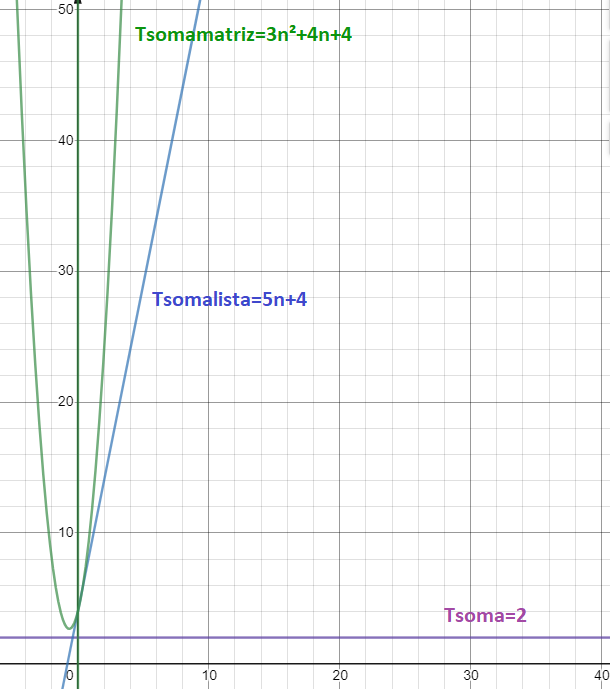
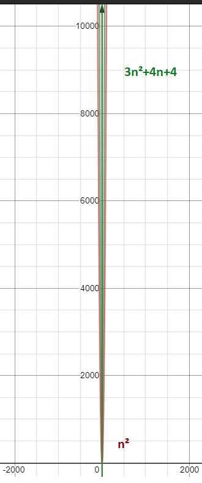
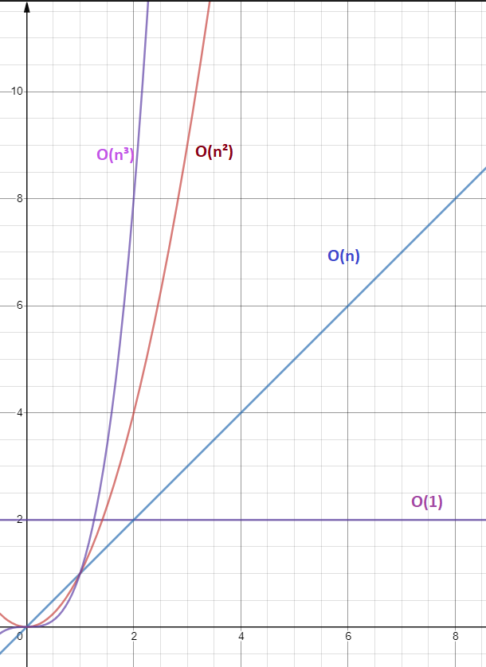

# Análise Assintótica de Algoritmos

## Motivação

**Por que devemos nos importar com a complexidade de tempo de um algoritmo?**

Uma situação que expõe com clareza a importância da análise de algoritmos é quando duas pessoas resolvem comparar suas soluções para um mesmo problema.

Imaginem que eu tenha solicitado para dois alunis, Daniel e Marina, que eles criem uma função que *recebe um número natural e retorna verdadeiro **se o número for primo**, e falso caso contrário*.

Daniel, ávido por resolver o problema, escreveu uma função que percorria de i=2 até i<n, e para cada iteração verificava se n era divisível por este valor.

```c
//Daniel
bool ehPrimo(unsigned int n){
    for(int i = 2; i < n; i++){
        if(n%i==0){
            return false;
        }
    }
    return true;
} 
``` 

Marina pensou um pouco mais e percebeu que se um número não possuir divisor até a raiz quadrada de n, então ele será primo.

```c
//Marina
bool ehPrimo(unsigned int n){
    for(int i = 2; i <= sqrt(n); i++){
        if(n%i==0){
            return false;
        }
    }
    return true;
} 
``` 

É fácil perceber que se n não for primo, o algoritmo de Marina executará menos instruções, sendo, portanto, mais eficiente.
Note que as análises de desempenho sempre focam no pior caso, isto é, a função sendo chamada com um argumento que force a execução da maior quantidade de instruções possível, ou seja, casos em que o número é primo.
O fato é que quando ambos executarem seus programas para valores muito altos de n, o programa de Daniel demorará demais, enquanto que o programa da Marina executará em um período de tempo viável.
Se assumirmos que ambos os computadores levam **1ms para realizar uma divisão** (apenas para fins de comparação), vamos ver quanto tempo os programas de Daniel e Marina levariam para executar se recebessem como entrada os seguintes valores para n: 11, 101, 10⁶ + 3, 10¹⁰ + 19. 

| n | Daniel (n-2) | Marina (sqrt(n)-1)|
| -------- | ---------- | ----------- |
| 11 | 9ms | sqrt(11)-1 = 2ms|
| 101 | 99ms | sqrt(101)-1 = 9ms |
| 10⁶ + 3 | 10⁶ms = 1000s = 16.6min| sqrt(10⁶)+3-1 = 1002ms = 1s |
| 10¹⁰ + 19 | 10.000.000.019ms = 10000000s = 115.74 dias| sqrt(10¹⁰)+19-1 = 100018ms = 100s = 1.6min |

A partir da tabela anterior, é possível observar que apesar do programa de Daniel ser extremamente rápido para valores muito pequenos de n, ele pode levar dias para valores muito grandes (e.g., 10¹⁰ + 19), enquanto o programa de Marina leva pouco mais de 1 minuto.

Ao analisar um algoritmo, um ponto estudado é a *complexidade de tempo*, ou seja, como o programa se comporta na medida em que a entrada cresce. O tempo do programa do Daniel cresce linearmente com a entrada, e isso pode ser representado pela notação **O(n)**. Já o programa da Marina possui tempo proporcional à raiz quadrada da entranda, i.e., **O(srqt(n))**. Chamamos esse símbolo de **Big-O**, e de maneira resumida ele simboliza o *pior tempo de execução* de um algoritmo em função da entrada. 

Ainda nessa disciplina veremos uma definição mais formal para essa notação.

## Calculando o Tempo de Execução de um Algoritmo

Um estudante iniciante neste tópico poderia argumentar que para medir o tempo de execução de um algoritmo bastaria marcar os tempos iniciais e finais, e calcular a subtração destes valores. Porém, este resultado é muito subjetivo e possui análise complexa, dado que muitas variáveis externas poderiam interferir no resultado.

O tempo de execução dependerá de fatores como:
 - arquitetura: 32 ou 64 bits?
 - processador: 1, 2, 4, 8 ou 16 cores?
 - velocidade de leitura e escrita na memória (principal e secundária)
 - quantidade de memória cache
 - sistema operacional e versões: windows, linux, mac?
 - LP e versões de compiladores 
 - **tamanho da entrada**

Quando se trata da análise de complexidade de um algoritmo, o único fator levado em consideração é o tamanho da entrada para o algoritmo. Isto é bom porque nos permite uma discussão de alto nível sem depender de detalhes de baixo nível de alguma máquina.

Na verdade, sabemos que programas executam em máquinas, e para conseguir remover os fatores específicos de máquina, comentados anteriormente, o que se faz é definir um *modelo hipotético de máquina*:
 - arquitetura: 32
 - processador: 1 núcleo (execução sequencial)
 - **1 unidade de tempo para operações aritméticas e lógicas**
 - **1 unidade de tempo para atribuições e retorno**

Geralmente, este é o modelo hipotético de máquina utilizado. Agora vamos usar este modelo hipotético de máquina para **avaliar a taxa de crescimento do tempo de execução de um programa em função de sua entrada**.

### Função 1: soma

```c
int soma(int a, int b){
    return a + b;
}
```

Agora vamos calcular o tempo de execução desta função soma de acordo com o modelo hipotético de máquina que definimos. Para isto, vamos usar a notação **Tsoma**. **Tsoma=2**, pois uma unidade de tempo vem da operação de soma, e outra unidade de tempo é decorrente da atribuição.

Note que neste caso, o tempo **Tsoma** sempre será 2, independentemente do tamanho da entrada (a e b). Por esta razão, é possível dizer que este é um algoritmo que possui **tempo constante** - ou seja, **Tsoma** assumirá constantemente o valor 2, e portanto, o tempo não depende da entrada.

### Função 2: soma de uma lista

```c
//n é o tamanho do array
int somaLista(int* a, int n){
    int soma = 0;   
    for(int i = 0; i < n; i++){
        soma += a[i];
    }
    return soma;
}
```
 Sem olhar pra a resposta abaixo, tente descobrir quantas unidades de tempo a função somaLista (**Tsomalista**) levaria. Dica (óbvia): faça devagarzinho, linha por linha, em vez de tentar analisar o bloco de código *for* de uma vez.

 A seguir é apresentada a análise da complexidade de tempo associada à função somaLista. 

```c
 int somaLista(int* a, int n){
     int soma = 0;      //atribuição: 1

     //atribuição inicial: 1
     //comparações: n+1
     //incremento (adição e atribuição): 2n
     for(int i = 0; i < n; i++){
         //o loop executa n vezes
         //adição e atribuição: 2n 
         soma += a[i];
     }
     //retorno: 1
     return soma;
 }
 ```

Logo,  **Tsomalista(n)**= 3 + (n+1) + 2n + 2n = **5n + 4**.

Como o que importa é a análise de **Tsomalista(n)** para valores muito altos de n, então as constantes 5 e 4 tem impacto marginal nessa situação. Não faria muita diferença expressar **Tsomalista** da seguinte maneira: **Tsomalista(n)** = cn + c', dado que c e c' são constantes.

### Função 3: soma de uma matriz quadrada

```c
//n é o tamanho do array
int somaMatriz(int mat[10][10], int n){
    int soma = 0;   
    for(int i = 0; i < n; i++){
        for(int j = 0; j < n; j++){
           soma += mat[i][j];
        }
    }
    return soma;
}
```

Uma outra dica interessante para fazer a análise de complexidade é colocar 2 colunas auxiliares: **custo e número de execuções.** A seguir mostro essa abordagem para analisar **Tsomamatriz**:

```c
//n é o tamanho do array
int somaMatriz(int mat[10][10], int n){     //custo;    nº exec
    int soma = 0;                           //1;        1   
    for(int i = 0; i < n; i++){             //1 [i=0];  1 
                                            //1 [i<n];  n+1 
                                            //2 [i++];  n 
        for(int j = 0; j < n; j++){         //1 [j=0];  n 
                                            //1 [j<n];  n*(n+1) 
                                            //2 [j++];  n*n 
           soma += mat[i][j];               //2;        n*n 
        }
    }
    return soma;                            //1;        1
}
```

Logo, **Tsomamatriz**= 1+1+(n+1)+n+n+(n*(n+1))+(n*n)+(n*n)+1= 3+3n+(n²+n)+2n²+1=**3n²+4n+4**.

### Analisando as Curvas das Funções

Com as funções que representam a complexidade de tempo, agora podemos observar o gráfico para fazer algumas reflexões.
Para isto, usei o site desmos: https://www.desmos.com/calculator/t9x1mzloef?lang=pt-BR.



Note que o eixo horizontal representa o crescimento da entrada **n**. O eixo vertical representa a complexidade de tempo do algoritmo. Dito isto, é possível observar que:
- **Tsoma** não depende da entrada, ou dito de outra forma, seu tempo será sempre constante;
- **Tsomalista** cresce linearmente com a entrada;
- **Tsomamatriz** cresce em proporção quadrática com a entrada;

Outro ponto importante é que quando estamos analisando a complexidade de tempo de um algoritmo, o que importa é **o que acontece quando n cresce demais**. Por exemplo, em **Tsomamatriz=3n²+4n+4**, se removermos as constantes 3, 4 e 4, teremos a função **n²**. A seguir vamos observar o que acontece com essas duas funções quando n é pequeno e quando n aumenta seu valor.

n baix             |  n alto
:-------------------------:|:-------------------------:
  |   

O que acontece é que quando o tamanho da entrada cresce, as constantes se tornam desprezíveis. Note que as curvas vermelhas e verdes quase se sobrepõem quando n é alto. Por essa razão, sempre que analisamos a complexidade de um algoritmo, as constantes são desprezadas. Como diferentes funções com diferentes constantes têm comportamento semelhante quando n aumenta, então agrupamos elas em conjuntos de funções que possuem o mesmo comportamento.

- Funções que possuem complexidade de tempo constante são agrupadas na família **O(1)**
- Funções que possuem complexidade de tempo linear são agrupadas na família **O(n)**. Exemplos:
    - *T=n*
    - *T=24n*
    - *T=2198721n+289372398*
- Funções que possuem complexidade de tempo quadrática são agrupadas na família **O(n²)**. Exemplos:
    - *T=n²*
    - *T=24n²*
    - *T=32423n²+n*
    - *T=3328912423n²+4234234n+3289782742*



Um exercício interessante é explorar o site do desmos (https://www.desmos.com/calculator/t9x1mzloef?lang=pt-BR), e analise melhor as seguintes funções para valores baixos e valores altos de n:
 - Função constante: y=1 ou y=2
 - Função logarítmica: y=log_2(n)
 - Função raiz quadrática: y=sqrt(n) 
 - Função linear: y=n
 - Função quadrática: y=n²
 - Função cúbica: y=n³
 - Função exponencial: y=eⁿ


