# Grafos

## Introdução

Em EDI vocês aprenderam a utilizar algumas estruturas de dados lineares e algumas estruturas de dados não-lineares. 

- Lineares:
    - ArrayList:
        - 
    - LinkedList:
        - 
    - DoublyLinkedList:
        - 
    - ArrayStack:
        - 
    - LinkedListStack:
        - 
    - ArrayQueue:
        - 
    - LinkedListQueue:
        - 
- Não-lineares:
    - Binary-search Tree:
        - 

Agora nós vamos estudar um outro tipo de ED não-linear, chamada **Grafo**. Segue uma ilustração do Tipo Abstrato de Dado para um Grafo.


Grafos, assim como árvores, são coleções de objetos (ou entidades) que chamamos de **nós ou vértices**, que são conectados entre si através de um conjunto de **arestas**. 
No entanto, quando se trata de árvores existem algumas regras para conectar dois nós.
Por exemplo: uma árvore com n nós deve possuir n-1 arestas; uma aresta para cada relação entre nó pai/mãe e nó filho.
Todos os nós em uma árvore tem um pai/mãe, exceto o nó raiz.
Em uma árvore todos os nós devem ser alcançados a partir da raiz, existindo apenas um caminho da raiz até o nó.
Por outro lado, grafos não possuem regras específicas para quantidade de nós, arestas, e relacionamentos. 
Um grafo contém um conjunto de nós e um conjunto de arestas, e as arestas podem conectar os nós de diversas formas.
No fim das contas, árvores são apenas casos especiais de grafos.

O estudo de grafos é referido por "Teoria dos Grafos".
Em termos matemáticos, podemos definir grafos como:
> Um grafo **G** é um par ordenado de um conjunto **V** de vértices e **E** de arestas (edges): **G = (V,E)**.

Obs: quando temos um par em que a ordem importa, estamos nos referindo a uma sequência, e nesses casos usamos parênteses **()** para defini-la. Quando a ordem de um par não importa, na verdade estamos nos referindo a um conjunto, e neste caso usamos chaves **{}** para expressá-lo.

Agora vamos reusar o exemplo anterior, mas desta vez daremos nomes/rótulos para cada vértice. 
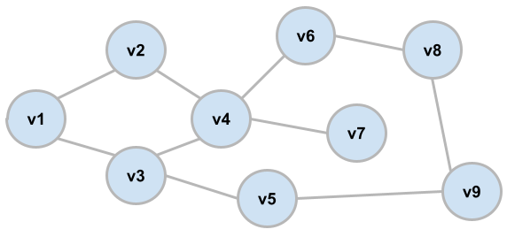

Note que apesar de usar os rótulos v1, v2, v3, etc, não existe um indicação de ordem entre vértices. Eu poderia usar qualquer rótulo para os nós.

No exemplo anterior, teremos os seguintes conjuntos de vértices e arestas. 
- **V = {v1, v2, v3, v4, v5, v6, v7, v8, v9}**
- **E = {{v1,v2}, {v1,v3}, {v2,v4}, {v3,v4}, {v3,v5}, {v4,v6}, {v4,v7}, {v5,v9}, {v6,v8}, {v8,v9}}**

Note que pelo fato da ordem dos vértices em V não importar nós usamos {}.
O mesmo serve para a ordem das arestas em E.
Além disso, como esse grafo é não direcionado, então a ordem de representação das arestas também não importa, visto que, por exemplo, **{v1,v2} é equivalente à {v2,v1}**.
Se o grafo fosse direcionado, então precisaríamos representar as arestas usando parênteses, por exemplo, **(v1,v2)**, sabendo que **(v1,v2) NÃO é equivalente à (v2,v1)**. 

Segue ilustação de aresta direcionada e aresta não direcionada.


É possível termos um Grafo com os dois tipos de arestas, direcionadas e não-direcionadas. No entanto, nesta disciplina vamos estudar apenas Grafos que são completamente compostos por arestas direcionadas, e Grafos que são completamente compostos por arestas não-direcionadas.

| Grafo Não-Direcionado | Grafo Direcionado () |
| -------- | ---------- |
|  | 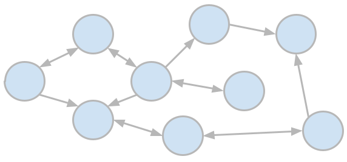 | 

Muitos problemas podem ser modelados usando grafos.
Grafos podem ser usados para representar quaisquer tipos de objetos ou entidades que possuam relacionamentos par-a-par.
- Lista de amigos em redes sociais.
    - Cada Usuário é representado por um nó.
    - Usuários que são amigos possuem relacionamento denotado por arestas.
    - Nesse caso arestas são não-direcionadas, pois amizade é um relacionamento mútuo (se eu sou seu amigo, você também é meu amigo).
    - 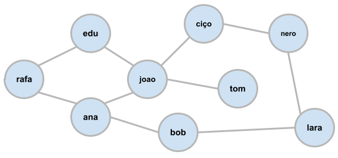
    - A representação em grafos pode ajudar a sugerir novas amizades para um usuário específico. Como vocês projetariam este algoritmo? 
        - Sugerir amigos de amigos.
        - João: Rafa, Bob, e Nero.
    - Este é um problema bastante conhecido da Teoria dos Grafos: a partir de um nó origem, encontrar todos os nós que tenham menor caminho igual 2.
- Página interligadas (hyperlinks) na Internet.
    - Cada Página é representada por um nó.
    - Uma página A que tem um hyperlink para outra página B terá relacionamento representado por aresta direcionada: A⇾B. 
    - Nesse caso arestas são direcionadas, pois é possível sair de uma página A para outra página B sem que seja possível sair da página B para a página A.
    - 
    - Nesse contexto, um grafo de páginas web pode ser usado pelo google para fazer web crawling.
        - Motores de busca aplicam algoritmos de web-crawler, para sistematicamente navegar na World Wide Web e coletar páginas. Motores de busca poderão então usar esses dados para prover resultados acurados rapidamente para as buscas que fazemos.
        - Web-crawling é basicamente navegação em Grafos.

Por fim, precisamos citar que grafos podem ser compostos por arestas com peso ou por arestas sem peso.
Em algumas situações, é desejável explicitar que uma aresta é mais importante do que outras arestas, e isto pode ser feito definindo pesos para as arestas.
Grafos cuja arestas possuem peso são chamados de **grafos ponderados** (ou grafos valorados), e grafos nos quais as arestas não possuem peso são chamados de **grafos não-ponderados**.
Um exemplo de aplicação de grafos ponderados seria representar as distâncias entre cidades.

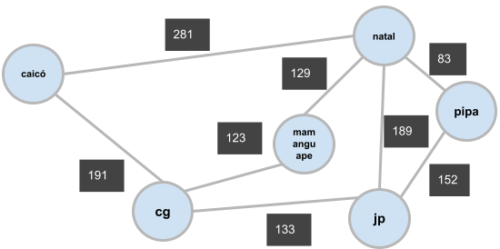

Qual seria o melhor caminho entre CG e Natal?
 - CG ⇾ Caicó ⇾ Natal = 472km
 - **CG ⇾ Mamanguape ⇾ Natal = 252km**
 - CG ⇾ JP ⇾ Natal = 322km
 - CG ⇾ JP ⇾ Pipa ⇾ Natal = 368km

 E se o grafo fosse não-ponderado? ...

 Note que grafos não-ponderados podem ser vistos como grafos ponderados, bastando atribuir os mesmos pesos à cada aresta.
 Da mesma forma, grafos não-direcionados podem ser vistos como grafos direcionados, bastando atribuirmos as duas direções para cada aresta. 

## Outras Propriedades

### Tipos de Arestas

No que diz respeito às arestas, podemos mencionar alguns tipos específicos de arestas como **laços** e **multi-arestas**.
Uma aresta é dita laço se os nós origem e destimo forem iguais.
Além disto, laços podem ser direcionados ou não, mas na verdade isto não mudaria em nada sua semântica.
Uma aresta pode ser considerada multi-aresta se houver outra aresta exatamente igual: partidno de um mesmo nó origem e chegando a um mesmo nó destino.
Por fim, multi-arestas podem ser direcionadas ou não-direcionadas, mas nesse caso, diferentemente do laços, o direcionamento altera a semântica do grafo.

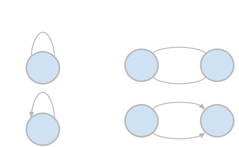

Um caso de uso para laços é a representação de hyperlinks entre páginas.
Note que algumas páginas podem possuir um link para ela própria (geralmente o botão "home"; ex: gmail). 
- 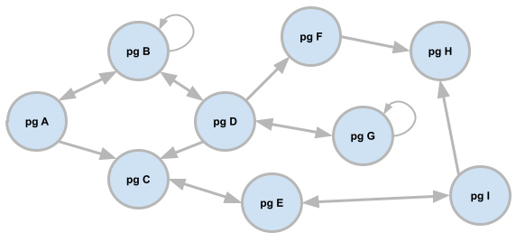

Um caso de uso para multi-arestas é a representação de vôos.
Embora multiplos vôos entre destinos A e B possuam o mesmo peso em termo de distância, talvez queiramos tornar explícito que existe mais de um vôo entre A e B, usando o nome do vôo e outros atributos relacionados a cada vôo/aresta.
- 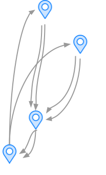

Se um grafo não contém laços ou multi-arestas, então podemos chamá-lo de **grafo simples**.
Na maioria dos casos vamos usar grafos simples.

### Número de Arestas

Agora vamos discutir um pouco sobre a relação entre quantidade de nós e arestas, considerando um grafo simples direcionado.

Considere um grafo com 4 nós.
- 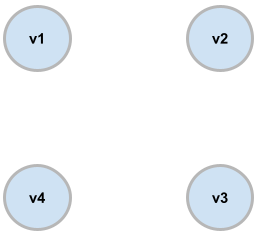
- O número mínimo de arestas é zero (|E|=0), pois podemos ter um grafo sem arestas.
- Com relação ao número máximo: experimente desenhar o máximo de arestas (direcionadas) no grafo anterior.
- 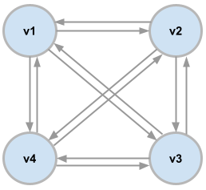
- Você deve ter percebido que cada nó consegue ser conectado com os demais n-1 nós.
- Portanto, o **número máximo de arestas em um grafo simples direcionado é n\*(n-1)**.
- Se o grafo for não-direcionado, cada relação entre dois nós, que antes era representada por 2 arestas, passará a ser representada por 1 aresta.
- Portanto, o **número máximo de arestas em um grafo simples não=direcionado é n\*(n-1)/2**

Em resumo:
 - **0 <= |E| <= n\*(n-1)**, se o grafo for direcionado e simples
 - **0 <= |E| <= n\*(n-1)/2**, se o grafo for não-direcionado e simples

 Note que o número máximo de arestas tende a ser consideravelmente maior do que o número de vértices:
 - se |V|=10, |E|<=90
 - se |V|=100, |E|<=9900

Sobre o número de arestas, ainda podemos classificar um grafo como **denso** ou **esparso**.
Um **grafo denso** tem muitas arestas, geralmente próximo do máximo possível (mas há subjetividade).
Um **grafo esparso** tem poucas arestas, geralmente uma quantidade muito abaixo do máximo possível (mas há subjetividade).
Muitas decisões importantes são tomadas baseadas no tipo de grafo, se ele é denso ou esparso.
Grafos densos geralmente são armazenados e manipulados com **matrizes de adjacências**.
Grafos esparsos geralmente são armazenados e manipulados com **listas de adjacências**.

Grafos podem ter passeios.
Um **passeio (walk)** é uma sequência de pares adjacentes conectados por uma aresta.
Observe o grafo que representa os links em páginas web.


Neste grafo, podemos citar todos os passeios possíveis partindo de A:
 - \<A,C,E,I,H\>
     - \<A,C\>
     - \<A,C,E\>
     - \<A,C,E,I\>
 - \<A,B,D,C,E,I,H\>
     - \<A,B\>
     - \<A,B,D\>
     - \<A,B,D,C\>
     - \<A,B,D,C,E\>
     - \<A,B,D,C,E,I\>
     - \<A,B,D,C,E,I,H\>
 - \<A,B,D,G\>
 - \<A,B,D,F,H\>
     - \<A,B,D,F\>

Todos os passeios citados anteriormente são **caminhos simples (simple paths)**, ou seja, passeios nos quais nenhum nó foi visitado repetidamente. 
Por exemplo, o passeio \<A,B,D,G,D,B,A\> não é considerado caminho pois existem nós repetidos.
Por fim, existem as **trilhas**: um passeio sem arestas repetidas, mas pode conter nós repetidos.
Vamos usar o exemplo de relacionamentos em redes sociais.

- 
- passeio que é um caminho simples: \<rafa,edu,joao,ciço\>
- passeio que é um caminho simples: \<rafa,ana,bob,lara,nero\>
- passeio que não é um caminho simples (é uma trilha): \<tom,joao,ciço,nero,lara,bob,ana,joao,edu\>
- note que a trilhar acima pode ser convertida em passeio simples, saindo da mesma origem e chegando ao mesmo destino: \<tom,joao,edu\>

Como trilhas podem ser convertidas em caminhos simples, geralmente o termo mais usado é **caminho (simples)**.

Um grafo é **conectado** se existe um caminho entre todos os nós.
Se o grafo for direcionado e existe um caminho entre todos os nós, então dizemos que o grafo é **fortemente conectado**.
Se o grafo for direcionado e não existe um caminho entre todos os nós, então dizemos que o grafo é **fracamente conectado**.

| - | 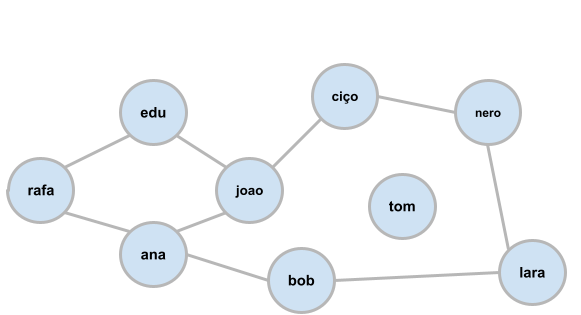 | 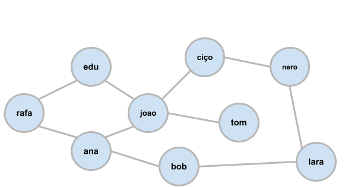  | 
| -------- | -------- | ---------- | 

|  | 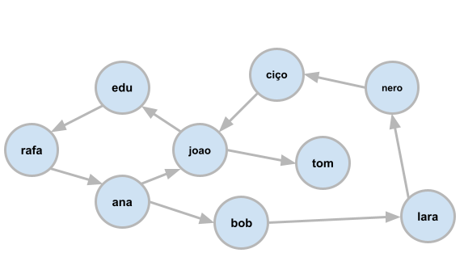 | |
| -------- | ---------- | ---------- |

Conectividade em um grafo é uma propriedade muito importante, visto que permitirá através de caminhos partir de qualquer nó como origem e chegar em qualquer nó como destino. 

Um passeio é considerado um **passeio fechado**, se iniciar e terminar no mesmo nó. 
Além disso, deve possuir comprimento (número de arestas) maior do que zero.
Ex: \<ana,joao,edu,rafa,ana>.
Um **ciclo simples** começa e termina no mesmo nó, mas não tem repetição além dos nós inicial e final.

Um grafo sem ciclo é chamado de **grafo acíclico**.
Grafos acíclicos podem ser não direcionados ou direcionados (directed acyclic graph - DAG).
Por exemplo: uma árvore na qual as arestas não possuem direção é um grafo acíclico não direcionado.

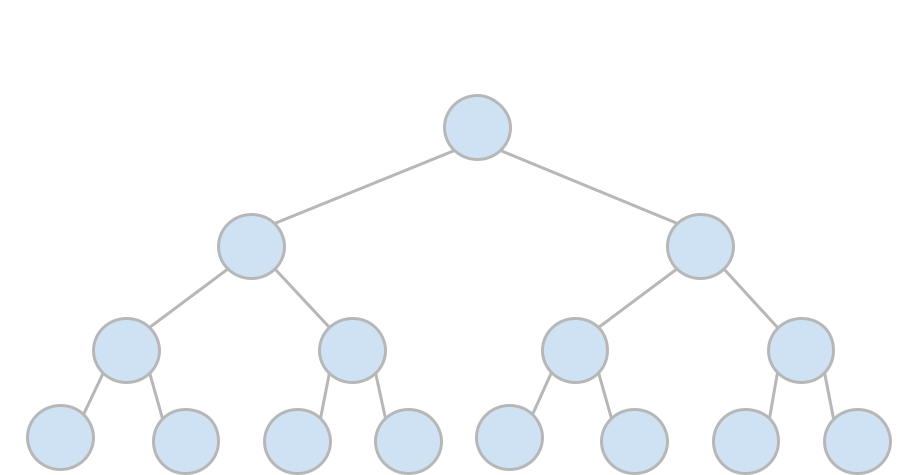 | 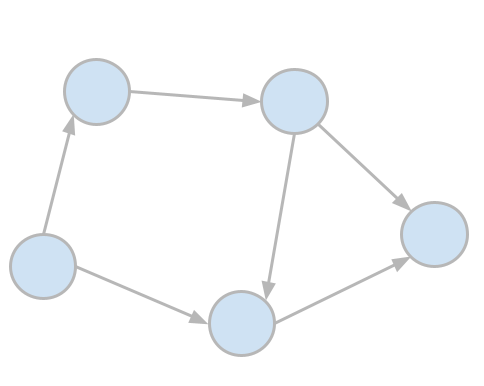|
| -------- | ---------- | 

Ciclos em grafos podem causar alguns problemas, no sentido de dificultar encontrar o menor caminho entre 2 nós, por exemplo.
Falaremos mais sobre ciclos e como resolver esse problema nas próximas aulas.

## Representações de Grafos: Lista de Vértices e Lista de Arestas 

Grafos são representados pela sequência **G=(V,E)**, um conjunto de vértices e um conjunto de arestas.
Logo, a forma de representação mais simples que podemos pensar são duas listas: uma para armazenar os nós, e outra para armazenar as arestas.

Como forma de exercício, preenchar as duas listas, V e E, de modo que representem o grafo a seguir:

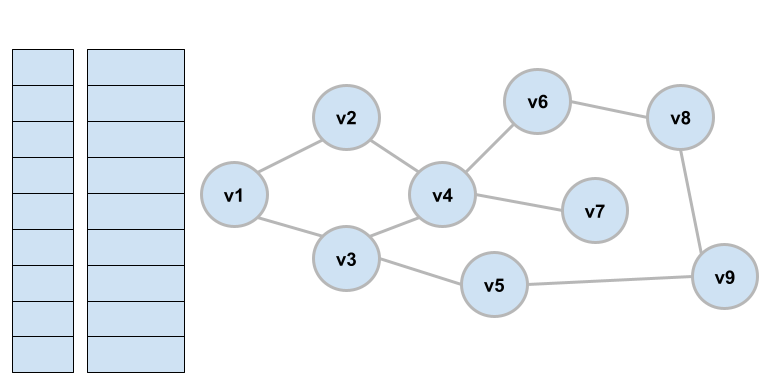

Para representar uma aresta, podemos criar um struct ou classe em CPP.
Para este exemplo, usei um struct que possui dois campos do tipo char \*, um para representar o nó origem, e outro para representar o nó destino. 
Mas note que pelo fato do grafo ser não-direcionado, então não faz diferença o nó ser origem ou destino.
COm relação as listas, elas poderiam ser instanciadas com **vector** ou **array**.

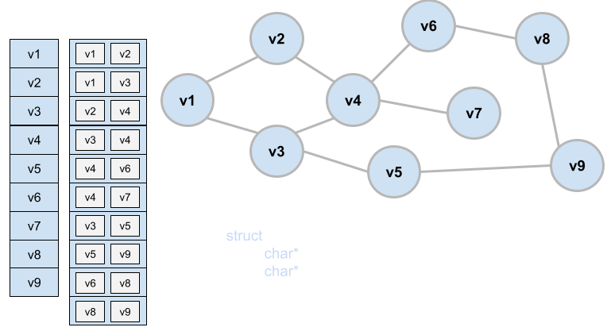

E se o grafo fosse ponderado?
Neste caso, bastaria adicionar ao struct Aresta um campo int que representaria o peso.

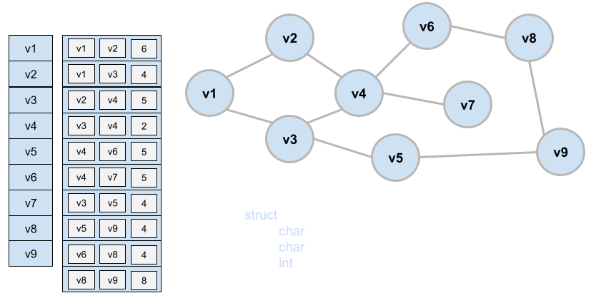

Agora vamos refletir sobre o custo dessa implementação.
Quando pensamos em custo, basicamente podemos ter um **custo de tempo** de processamento das operações e **custo de espaço** para armazenamento da estrutura de dados. 
Em outras palavras, queremos analisar a complexidade de tempo e complexidade de espaço relacionados à implementação proposta.

**Do ponto de vista da complexidade de espaço, o que podemos afirmar?**

Sobre a lista de vértices, a complexidade de espaço será **O(|V|)**. Como cada linha contém uma string, não podemos presumir o tamanho em bytes, visto que strings podem possuir diferentes tamanhos, baseado na quantidade de caracteres. No entanto, não é de se esperar que os rótulos dos nós possuam uma quantidade muito grande de caracteres (e.g., grafos que representam distância entre cidades).

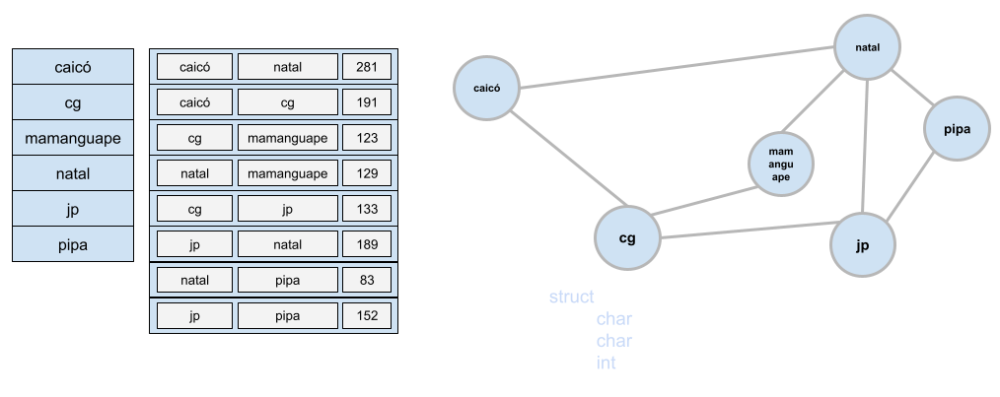

Sobre a lista de arestas, cada linha irá armazenar 2 strings e 1 inteiro. Mais uma vez podemos assumir que essas strings terão curto comprimento, possuindo poucos caracteres. No entanto, uma opção melhor seria substituir as strings por ponteiros que irão armazenar o endereço de memória para a string contendo o rótulo do nó. Uma alternativa semelhante seria armazenar o índice daquele nó na lista de vértices. 

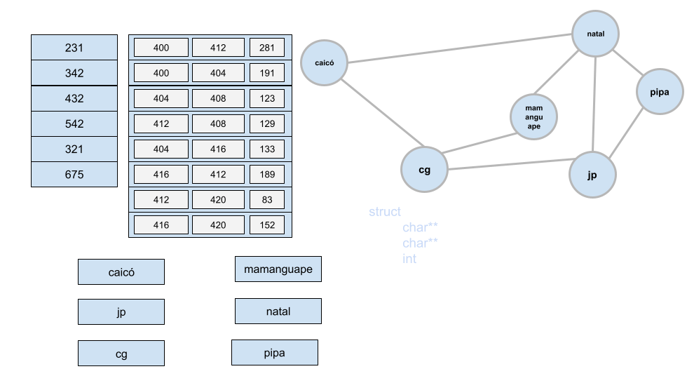

Uma outra alternativa seria armazenar na lista de arestas o índice dos nós na lista de nós.

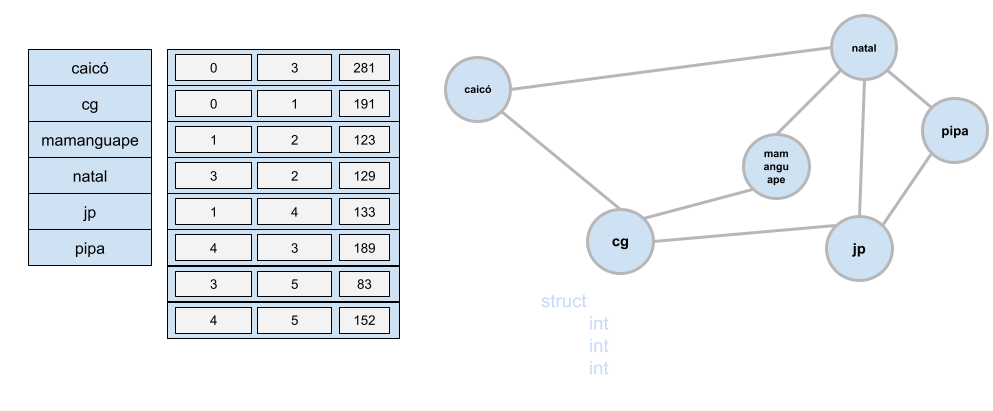

Qualquer uma das abordagens, usando ponteiros ou índices, fará com que a quantidade de memória usada seja a mesma.
Neste caso, cada linha da lista de arestas custaria 12 bytes, ou seja, uma quantidade constante de memória.
Portanto, a complexidade de espaço para a lista de arestas será proporcional à quantidade de arestas, i.e., **O(|E|)**.

Logo, ao representar um grafo com uma lista de arestas e uma lista de nós, a complexidade de espaço seria **O(|V|+|E|)**.

**Do ponto de vista da complexidade de tempo, o que podemos afirmar?**

Primeiro precisamos definir a operação estamos buscando entender a complexidade de tempo.
**Operação 1: encontrar todos os nós diretamente conectados com um nó específico.**
Olhe para a ilustração e tente entender o algoritmo.

Para encontrar todos os nós diretamente conectados com um nó específico, precisaríamos varrer toda a lista.
Isto nos daria uma complexidade **O(|E|)**.

**Operação 2: descobrir se 2 nós estão conectados ou não.**

Para descobrir se 2 nós estão conectados ou não, também precisaríamos varrer toda a lista.
Isto também nos daria uma complexidade **O(|E|)**.

Agora vamos tentar aprofundar quão bom ou ruim pode ser **O(|E|)**.
Lembrando o que foi discutido anteriormente (assuma |V|=n):
- **0 <= |E| <= n\*(n-1)**, se o grafo for direcionado e simples;
- **0 <= |E| <= n\*(n-1)/2**, se o grafo for não-direcionado e simples.

Então, uma outra forma de expressar **O(|E|)** seria em termos da quantidade de nós (assuma |V|=n):
- O(n\*(n-1)) ⇾ O(n²-n) ⇾ **O(n²)**, se o grafo for direcionado e simples;
- O(n\*(n-1)/2) ⇾ O(n²/2-n/2) ⇾ **O(n²)**, se o grafo for não-direcionado e simples.

Só pra constar, sabemos que **O(n²)** é considerado ruim.
Portanto, devemos buscar outra forma de armazenar um grafo que melhor a complexidade de tempo das operações sobre os grafos.

## Representações de Grafos: Matriz de Adjacências 

Uma outra forma de representar arestas de um grafo é utilizando uma matriz de adjacências em vez de uma lista de arestas.
Nessa matriz de adjacência, podemos preencher cada posição com true ou false (ou 0 ou 1) de acordo com a existência ou não de uma aresta ligando cada par de nós.

- E[i][j]:
    - 1, se houver uma aresta entre os nós que estão no índice i e j do array de nós
    - 0, caso contrário.

[Link para exercício no google draw.](https://docs.google.com/drawings/d/1mEqR4803liK-P_lqANRs7VJvkbDRk9mB4_xD9ZD1-kM/edit?usp=sharing)


A matriz de adjacências que representa essa lista de arestas é ilustrada a seguir.

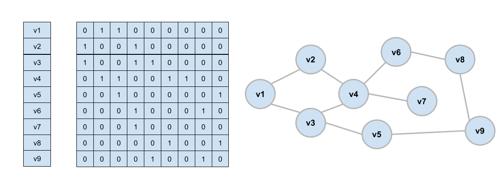

Se o grafo for ponderado, basta substituir os valores 1/true pelo peso das arestas, e os valores 0/false por ∞, ou um valor que se sabe que não será utilizado. 
Note que podem existir grafos que possuam arestas com peso 0. 
De modo geral, ∞ tende a ser melhor pois simplifica o algoritmo.
<!--https://www.reddit.com/r/learnprogramming/comments/5mq8o4/for_weighted_graph_represented_as_adjacency/-->


Um ponto interessante: para grafos não direcionados, a matriz de adjacências que representa a aresta é simétrica.
Em outras palavras, E[i][j] = E[j][i].
Portanto, nesse caso, poderíamos economizar metade deste espaço, bastando apenas utilizar um lado da matriz.
Isto poderia ser feito alocando a quantidade de valores necessários para cada linha, em vez de alocar um matriz quadrada de forma simplificada.

Por outro lado, quando se trata de grafos direcionados, a matriz de adjacências que representa a aresta não é simétrica. 

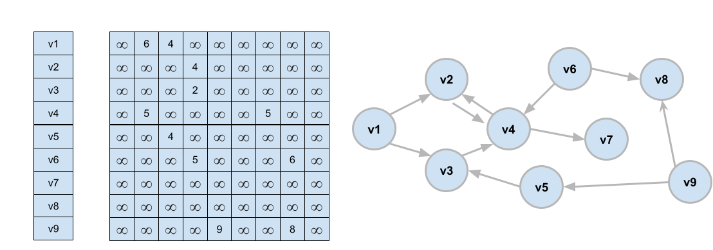

Com relação à **complexidade de espaço**, um grafo direcionado com |V| vértices terá uma matriz de adjacências com |V|² espaços.
Logo, temos: O(|V|²).
Se o grafo for não direcionado, então teríamos uma PA representando a quantidade de espaços na matriz: 1, 2, 3, 4, ..., |V|-1, |V|.
Já sabemos que quando temos uma sequência deste tipo, a complexidade é quadrática, portanto, O(|V|²).

Com relação à **complexidade de tempo**, precisamos analisar as operações individualmente.

**Operação 1: encontrar todos os nós diretamente conectados com um nó específico.**

Primeiramente, precisamos descobrir o índice referente àquele nó na lista de nós, o que custa O(|V|). (Às vezes esse custo pode ser evitado se soubermos o índice que representa um nó.)
Em seguida, sabendo o índice da matriz que representa o nó, basta percorrer a linha encontrada e listar os índices dos nós que formam aresta com aquele nó específico.
Uma varredura numa linha/coluna de uma matriz leva O(|V|).
Portanto, a complexidade de tempo é O(|V|+|V|), ou seja, **O(|V|)**.

Quando usamos a lista de arestas como ED, para encontrar todos os nós diretamente conectados com um nó específico, precisaríamos varrer toda a lista de arestas.
Isto nos daria uma complexidade O(|E|).

Note que a matriz de adjacências, portanto, quando comparada à representação que usa lista de arestas, apresenta uma melhor complexidade de tempo para a operação *encontrar todos os nós diretamente conectados com um nó específico*.
 - **Lista de arestas: O(|E|), e portanto O(|V|²)**
 - **Matriz de Adjacências: O(|V|)**

**Operação 2: descobrir se 2 nós estão conectados ou não.**

Para descobrir se 2 nós estão conectados ou não, considerando que estes nós estejam nas posições i e j da lista de nós, basta verificar o valor em **E[i][j]** ou o valor em **E[j][i]**, dependendo do tipo de grafo.
A primeira parte, custa O(|V|), pois seria preciso varrer a lista de nós para descobrir os índices i e j.
Se alguma técnica, como hashing, for aplicar, esses valores poderiam ser descoberto em O(1).
A segunda parte custa O(1), pois consultar uma posição específica de um array bidimensional é instantâneo.

Note que a matriz de adjacências, portanto, quando comparada à representação que usa lista de arestas, apresenta uma melhor complexidade de tempo para a operação *descobrir se 2 nós estão conectados ou não*.
 - **Lista de arestas: O(|E|), e portanto O(|V|²)**
 - **Matriz de Adjacências: O(1)**

**Discussão**

Matrizes de adjacência são ótimas para custo das operações, mas péssimas com relação ao uso de memória.
Sempre irão usar |V|² espaços de memória para representar as arestas, independentemente do grafo ser esparso ou denso.
Já listas de arestas podem usar pouca memória caso o grafo seja esparso.
Isso nos leva a concluir que:
 - podem ser boas para grafos com poucos vértices;
 - podem ser boas para grafos densos, de modo que pouco espaço ficasse ocioso na memória.

 Porém, o fato é que a maioria dos grafos de problemas reais possuem uma quantidade absurdamente grande de nós, o que tornaria o uso da matriz de adjacências inviável.
 Além disto, os grafos de problemas reais raramente são densos.
 Imagine: 
  - o grafo que representa o relacionamento entre pessoas em redes sociais como Instagram e Facebook
      - 10^9 pessoas
      - (10^9)^2 = 10^18 conexões (se cada pessoa fosse amigo de todo mundo)
      - se cada pessoa tiver 10^3 amigos, então teríamos |E| = (10^9 \* 10^3)/2 = (10^12)/2 = 5 \* 10^11
      - 5 \* 10^11 << 10^18
      - 10^18 bytes = 1000 PB
      - 5 \* 10^11 bytes = 500 GB
  - o grafo que representa as referências entre páginas de Internet via hiperlink.
  - o grafo que o Google Maps usa para representar a distância entre cidades.

Todos esses grafos possuem uma infinidade de nós, e além disso, tipicamente são grafos esparsos.
São grafos nos quais cada nó se relaciona com uma fração muito pequena do total de nós existentes.

**No entanto, existe uma outra representação que provê complexidade de tempo para operações bastante similares (as vezes até melhor), mas que não requer esta alocação exagerada de memória: Lista de Adjacências.**

## Representações de Grafos: Lista de Adjacências 

Matrizes de adjacências proporcionam um excelente desempenho para processamento de operações.
No entanto, o principal problema é o consumo exagerado de memória.

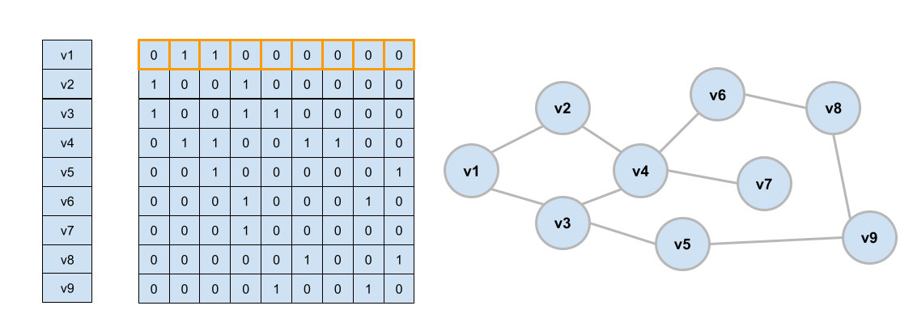

Podemos analisar a matriz estudando cada linha de forma individual.
A primeira linha, ou seja, linha referente ao índice 0, representa a existência ou não de aresta entre o nó v[0] e todos os outros nós do grafo.
Obviamente, e[0][0]=0 pois este grafo é simples e não possui laços.
Em seguida, podemos perceber que e[0][1]=1, indicando que existe aresta entre v[0] e v[1], ou seja, nós **v1** e **v2**.
Similarmente, e[0][2]=1 indica que existe aresta entre v[0] e v[2], ou seja, nós **v1** e **v3**.
Os demais, e[0][3]=0, e[0][4]=0, ..., e[0][8]=0, apenas indicam a não-existência de arestas entre esses nós.
E é justamente este aspecto, a representação explícita da inexistência de arestas, que torna a matriz de adjacências muito custosa em termos de memória.
Uma abordagem mais simples seria representar simplesmente a existência de arestas entre os nós, e qualquer outra aresta não explicitada seria considerada inexistente.

Voltemos ao exemplo de relações de amizade numa rede social.
Considerando que a rede possua 10^9 pessoas, **cada linha da matriz de adjacências possuiria 10^9 espaços**.
Considerando também que em média, cada pessoa possui cerca de 10^3 amigos, então nós teríamos 10^9 - 10^3 = 999999000 espaços ociosos na matriz.
Ou seja, se o grafo for ponderado, onde utilizaremos um byte por espaço de memória alocado, então apenas 1KB seria utilizado, e ~1GB estaria ocioso (considerando a representação de relações de amizar entre apenas 1 pessoa e o resto da rede).

Uma forma de economizar espaço é simplesmente manter uma lista dos nós destino aos quais um nó origem está conectado.
Em vez de **e[0] = {0,1,1,0,0,0,0,0,0}**, poderíamos ter **e[0]={1,2}** ou **e[0]={v2,v3}**.
Isto poderia ser feito, por exemplo, com um ArrayList, LinkedList, com uma árvore (BST), ou até mesmo com uma tabela Hash. 

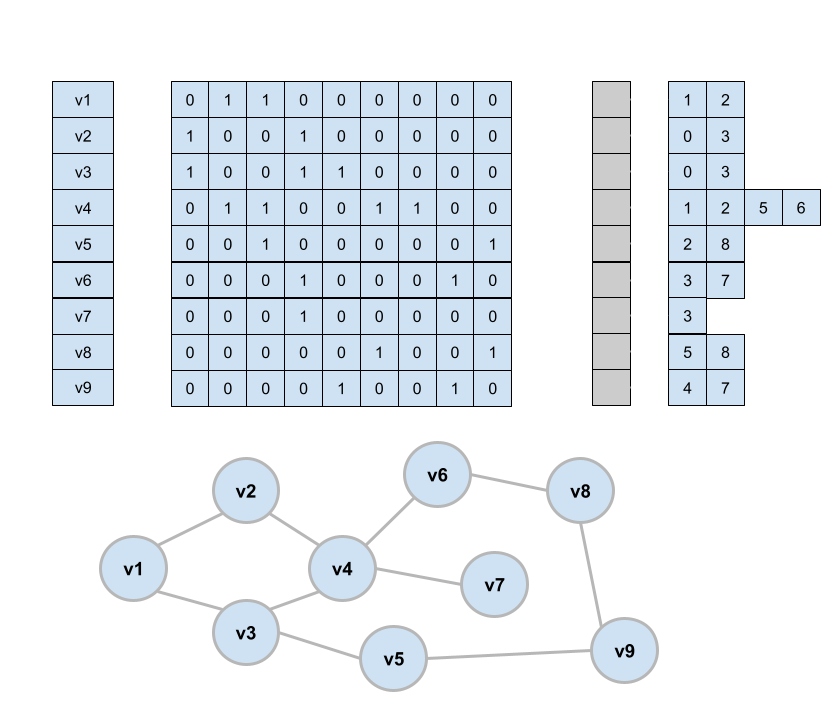

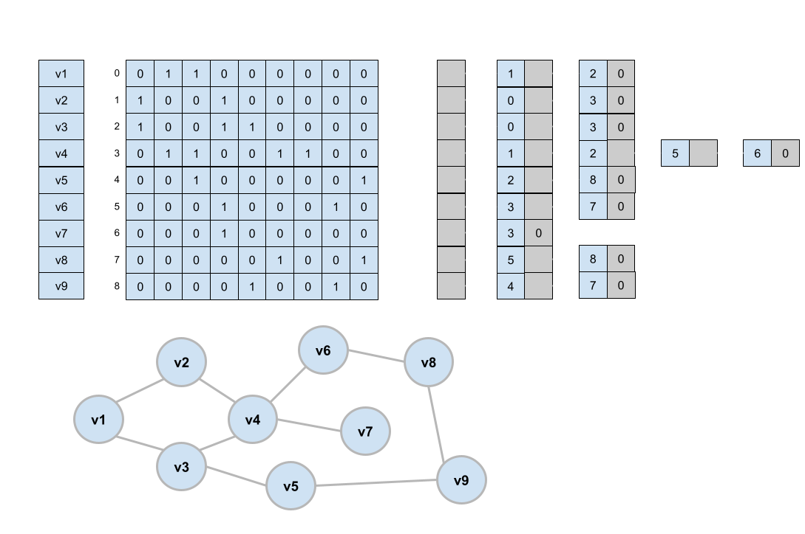

## Navegação em Grafos

Uma das aplicações de navegação em grafos é verificar, por exemplo, se existe um caminho entre dois nós.
Os dois algoritmos mais comuns de navegação são busca em profundidade (ou Depth First Search - DFS) ou busca em largura (Breadth First Search - BFS).
Ambos alcançam o mesmo objetivo, de percorrer todos os nós do grafo, mas com diferentes estratégias.

### DFS

DFS é estudada primeiro devido a sua simplicidade de implementação.
Como o nome sugere, a navegação por DFS explora os caminhos focando em profundidade em vez focar inicialmente na expansão de todos os caminhos possíveis (como acontece na BFS).

A ideia do algoritmo é partindo de um nó origem, navegar recursivamente por outros nós, e marcar os nós que já foram visitados (com um vetor, por exemplo).

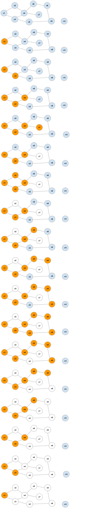

Segue algoritmo da DFS:

```c
void dfs(int origem){
    if(visitado[origem])
        return;
    visitado[origem] = true;

    vector<int> vizinhos = arestas[origem];
    for(int i = 0; i < vizinhos.size(); i++){
        dfs(vizinhos.at[i]);
    }
}
```

- Identificar componentes em um grafo não conectado. A ideia é colorir cada componente do grafo, ou em outras palavras, rotular vértices de cada componente com mesmo valor. Para isso, basta aplicar a dfs em todos os nós, impedindo de visitar e colorir nós que já foram visitados anteriormente.

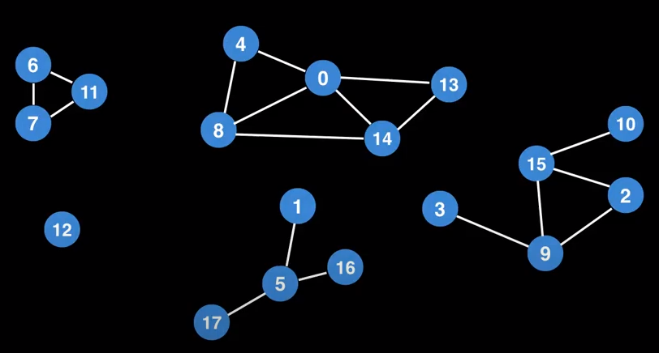

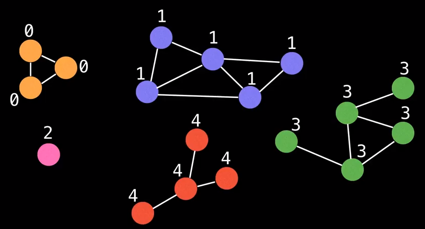

```c
//retorna qtdade de componentes (ou cores usadas)
int colorir(){
    int cor = 1;
    for(int i = 0; i < vertices.size(); i++){
        if(!visitado[i]){
            dfs(i); //dfs irá alterar a variável global visitado
            //neste ponto podemos descobrir quais vértices
            //foram visitados e mudar o valor de seus rótulos
            cor++;
        }
    }
    return cor;
}
```

### BFS

BFS é um pouco mais elaborada do que a DFS
Como o nome sugere, a navegação por BFS explora os caminhos focando em larguram em vez focar inicialmente na expansão profunda de cada caminho (como acontece na DFS).
Além de explorar todos os caminhos possíveis, a peculiaridade de explorar em amplitude naturalmente nos dá o menor caminho entre dois vértices de um grafo não-ponderado.

A ideia do algoritmo é partindo de um nó origem, navegar explorando primeiramente os nós vizinhos, de forma a explorar todos os caminhos possíveis antes de se aprofundar em um caminho. Todos os nós visitados devem ser marcados como visitados.

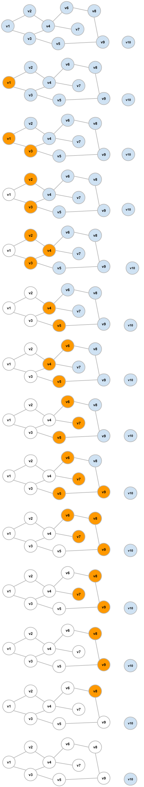

Para a BFS, a melhor forma de controlar quais são os próximos nós a serem visitados é usando uma fila.
Segue ilustração da BFS detalhando o uso da fila.

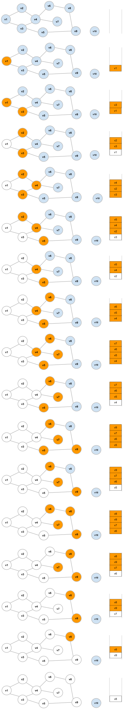

```c
int* bfs(int indexVOrigem) {
    visited[indexVOrigem] = true;
    distance[indexVOrigem] = 0;
    q.push(indexVOrigem);
    while (!q.empty()) {
        int s = q.front(); q.pop();
        // process node s
        for (auto u : adj[s]) {
            if (!visited[u]){
                visited[u] = true;
                distance[u] = distance[s]+1;
                q.push(u);
            }
        }
    }
    return distance;
}
```

## Menor Caminho em Grafos Ponderados

### Bellman-Ford

The Bellman–Ford algorithm finds shortest paths from a starting node to all nodes
of the graph. The algorithm can process all kinds of graphs, provided that the graph
does not contain a cycle with negative length. If the graph contains a negative cycle,
the algorithm can detect this.

The algorithm keeps track of distances from the starting node to all nodes of the
graph. Initially, the distance to the starting node is 0 and the distance to any other node
in infinite. The algorithm then reduces the distances by finding edges that shorten
the paths until it is not possible to reduce any distance.


Algoritmo (extraído do livro "Guide to Competitive Programming", de Antti Laaksonen):

```c
for (int i = 1; i <= n; i++) {
    distance[i] = INF;
}
distance[x] = 0;
for (int i = 1; i <= n-1; i++) {
    for (auto e : edges) {
        int a, b, w;
        tie(a, b, w) = e;
        distance[b] = min(distance[b], distance[a]+w);
    }
}
for (auto e : edges) {
    int a, b, w;
    tie(a, b, w) = e;
    if(distance[a] + w < distance[b])
        distance[b] = -INF;
}
```

### Dijkstra

O algoritmo de Dijkstra encontra o menor caminho partindo de um vértice origem até os demais vértices, assim como o algoritmo de Bellman–Ford.
Dijkstra tem uma restrição e uma vantagem.
A restrição é que não funciona para grafos com pesos negativos (o que inclui grafos com ciclos negativos).
A vantagem do Dijkstra está em sua performance. Disjktra tem complexidade de tempo O(E+V), enquanto Bellman-Ford possui complexidade de tempo O(E\*V).

Assim como em Bellman-Ford, o algoritmo de Dijkstra mantém distâncias para os vértices e as reduz durante a pesquisa. 
Em cada etapa, o algoritmo de Dijkstra seleciona um vértice que ainda não foi visitado e cuja distância é a menor possível. 
Então, o algoritmo passa por todas as arestas que começam no vértice e reduz as distâncias. 
O algoritmo de Dijkstra é eficiente, porque ele só processa cada aresta no grafo uma vez, usando o fato de que não há arestas negativas.

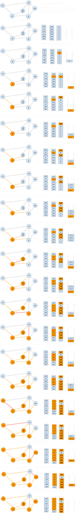

Algoritmo (extraído do livro "Guide to Competitive Programming", de Antti Laaksonen):

```c
priority_queue<pair<int,int>> q;
for (int i = 1; i <= n; i++) {
    distance[i] = INF;
}
distance[x] = 0;
q.push({0,x});
while (!q.empty()) {
    int a = q.top().second; q.pop();
    if (processed[a]) continue;
    processed[a] = true;
    for (auto u : adj[a]) {
        int b = u.first, w = u.second;
        if (distance[a]+w < distance[b]) {
            distance[b] = distance[a]+w;
            q.push({-distance[b],b});
        }
    }
}
```